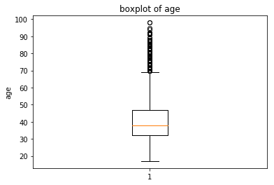
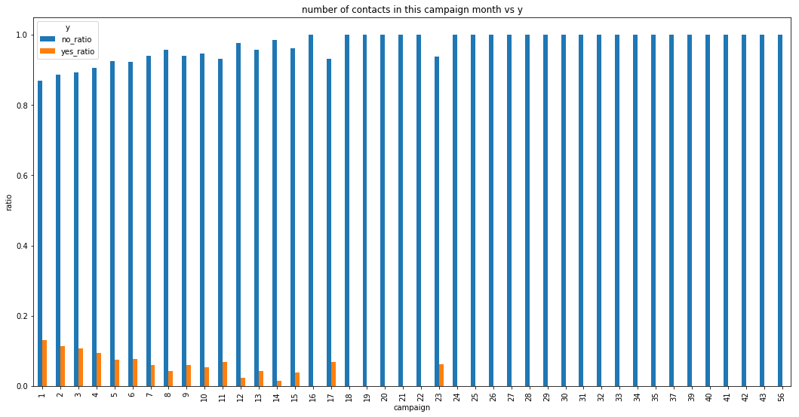

# Project: Bank Marketing Prediction

# Table of Contents
- [Project Description](#project-description)
- [Environment and Programming language](#environment-and-programming-language)
- [Data Description](#data-description)
- [Exploratory Data Analysis](#exploratory-data-analysis)
  * [Reading the Data](#reading-the-data)
  * [Data Exploration](#data-exploration)
  * [Single Variable Analysis](#single-variable-analysis)
  * [Relationship between Features and outcome variable y](#relationship-between-features-and-outcome-variable-y)
- [Data Pre-processing](#data-pre-processing)
- [Model Evaluation](#model-evaluation)
  * [Benchmark Model](#benchmark-model)
  * [Evaluations Matrices](#evaluations-matrices)
- [Model Selection](#model-selection)
  * [Best classifier selection](#best-classifier-selection)
- [Model Tuning](#model-tuning)
- [Feature Selection](#feature-selection)
- [Model Fitting on Reduced Data](#model-fitting-on-reduced-data)
- [K-fold cross Validation](#k-fold-cross-validation)
- [Checking time requirements on reduced data set](#checking-time-requirements-on-reduced-data-set)
- [Further Improvements](#further-improvements)
- [Further Reading](#further-reading)

## Project Description
This project is related to the telemarketing. Telemarketing is a domain in which
companies directly contact customers and try to sell the products which can help
customer to achieve their goals.

In telemarketing, customer can be contacted by any means like e-mails, calls, etc. As
part of telemarketing process, customer is contacted and provided information
about a product and it can sometimes be required to contact customer more than
one time.

The problem in telemarketing domain is company have to call all of the customers be
it a potential customer or not. This become a lot of logistical work and lot of efforts
are wasted on the customers which don’t fit in the potential buyer category for that
product.

This problem requires solution so that company can target only the potential
customers which have higher probability to buy that product instead of wasting
efforts on the customers which have lower probability of buying that product.

So past data can be used for the data analysis and ultimately machine learning
techniques can be applied to predict the potential buyers as per various attributes
related to customers.

This kind of problem has already been researched and following is the link of the
same.

http://media.salford-systems.com/video/tutorial/2015/targeted_marketing.pdf

## Environment and Programming language
* Python 2.7.14 has been used.
* Miniconda framework has been used which can be downloaded from this [link](https://repo.continuum.io/miniconda/).
* Once installed, open conda prompt.
* Create virtual environment by using `conda env create -f environment.yaml`. [**environment.yaml**](./environment.yaml) has been included in the repository.
* Jupyter notebook has been used for interactively analyzing and exploring the data.
* Python code and calculation given in the [Notebook file](./Capston_Project.ipynb) file.
* [Data set](./bank-additional-full.csv) file is given as .csv file.

## Data Description
Data set has been acquired from UCI machine learning repository. Following is the link of the same.

https://archive.ics.uci.edu/ml/machine-learning-databases/00222/bank-additional.zip

Dataset contains information related to direct marketing campaigns of Portuguese
banking institution. The marketing campaigns were based on phone calls and often
more than one contact to the same client was required, to access if the product
would be yes or no for the subscription.
**Dataset contains 41188 examples and 20 input variables.** Following are the input
variables.
1. **Age:** Age is the factor which can impact client interest in the term deposit.
2. **Job:** This is type of job client have.
3. **Marital:** This is marital status of the client.
4. **Education:** This gives educational background of the client.
5. **Default:** Whether client has credit in default.
6. **Housing:** Client has housing loan or not.
7. **Lona:** Client has personal loan or not.
8. **Contact:** contact communication type. Cellular or telephone.
9. **Month:** Last contact month of the year.
10. **Day_of_week:** Last contact day of the week.
11. **Duration:** last contact duration in seconds. This attribute highly affects the
output target (if duration = 0 then y = “no”). This input will only be included
for the benchmarking purposes and will be discarded for predictive
modelling.
12. **Campaign:** Number of contacts performed during this campaign for this client
including last contact.
13. **Pdays:** Number of days that passed by after the client was last contacted
from a previous campaign. 999 means client was not previously contacted.
14. **Previous:** number of contacts performed before this campaign and for this
client.
15. **Poutcome:** Outcome of the previous marketing campaign.
16. **Emp.var.rate:** Employment variation rate - quarterly indicator.
17. **Cons.price.idx:** Consumer price index - monthly indicator.
18. **Cons.conf.idx:** Consumer confidence index - monthly indicator.
19. **Euribor3m:** Euribor 3 month rate - daily indicator.
20. **Nr.employed:** Number of employees - quarterly indicator.
21. **Y:** Output variable. Has client subscribed to term deposit or not?

**All the above mentioned will be used for analysis and the prediction model building
except the “Duration”.**

## Exploratory Data Analysis

### Reading the Data
I used `pd.read_csv("bank-additional-full.csv", sep=";")` from **pandas** library to read the data. Separator in the .csv file is **;** so I used the same while reading the data.

### Data Exploration
* **`bank_additional.info()` output shows there is no missing or null values in the dataset. Following is the output of the same:**
```
<class 'pandas.core.frame.DataFrame'>
RangeIndex: 41188 entries, 0 to 41187
Data columns (total 21 columns):
age               41188 non-null int64
job               41188 non-null object
marital           41188 non-null object
education         41188 non-null object
default           41188 non-null object
housing           41188 non-null object
loan              41188 non-null object
contact           41188 non-null object
month             41188 non-null object
day_of_week       41188 non-null object
duration          41188 non-null int64
campaign          41188 non-null int64
pdays             41188 non-null int64
previous          41188 non-null int64
poutcome          41188 non-null object
emp.var.rate      41188 non-null float64
cons.price.idx    41188 non-null float64
cons.conf.idx     41188 non-null float64
euribor3m         41188 non-null float64
nr.employed       41188 non-null float64
y                 41188 non-null object
dtypes: float64(5), int64(5), object(11)
memory usage: 6.6+ MB
```
* **We can clearly see that outcome variable y values are skewed towards the "no" as we have count of "no" are almost 8 times more than count of "yes". Following is the plot of the same.**


### Single Variable Analysis
This section provides the single variable analysis of various columns in dataframe. Numeric values will be analyzed using histograms and boxplots and categorical variables will be analyzed with counts.

* **From the histogram of age distribution, we can clearly see distribution has high values between 24 years to 60 years and then steep fall beyond that on both the sides. So it is clear that calls were made more to the people with age from 24 years to 60 years. Following is the plot of the same:**


* **We can clearly see there are some outliers in the age variable but these outliers can't be ignored. Same is shown in boxplot given below.**


* **From the histogram and boxplot of duration, we can clearly see these values are highly skewed. Also this variable is highly correlated with outcome as if duration is 0 then outcome is definitely "no". So we need to remove this variable while working on this dataset.**
 

* **We can see another skewed histogram for and boxplot for the number of times a particular client was contacted during this campaign. Most of the clients were contacted either 1, 2, or 3 times but we can see some clients were contacted around 30-40 times as well.**
 

**I further plotted barplots of other variables and following are the outcomes of the same**

* **From the bar graph it is clear that most of clients were contacted first time. Value 999 denotes that client was never contacted previously.**


* **From this bar plot, we can see that most of the clients were contacted first time.**


* **Below 5 graphs are social indicators and doesn't depict much information here.**


* **Below 3 graphs shows the distribution of job type, marital status and education level. Permanent job people, married and high education clients were contacted more.**


* **Cleints with credit defaults were not contacted most of the times as we can see only count as 3.**


* **Not very high difference between clients who has housing loan or who doesn't have but clients with housing loan were contacted more.**


* **Clients with no personal loan are preferred**


* **More number of clients were called on cellular phones instead of telephone.**


* **Very less number of clients were called in September, October, December and March.**


* **Almost uniform distributions of clients across the days of the week.**


* **Most of the clients were called whose previous outcome doesn't exists. This is because most clients were new and have never been called before.**


### Relationship between Features and outcome variable y
In this section, I will analyze the relationship between features and outcome variable y. Function `crosstab_plot(variable1, variable2, title, filename, ylabel = "ratio")` is used for this. This function implement following steps:
1. Calculate the crosstab between 2 variables.
2. Calculates **total**, **yes_ration** and **no_ratio** and save them under separate columns.
3. Prints the final crosstab table.
4. Plot and save the crosstab bar plot.

Following is the analysis of various plots of crosstab:
* **We can see from the following plot that success ratio is higher for the clients with age below 25 and above 60. In the mid age group success ratio is less. So this feature can be made a categorical variable and looks impacting the outcome.**


* **Success ratio among retired and students are higher as compared to other professions.**


* **Not very high difference among the success ratios of different relationship types but it seems success ratio of Singles and unknowns are comparatively high.**


* **Success ratio is higher for illiterate but sample size is very small. There is not strong correlation between success and client education but it seems higher the education better are the chances for success.**


* **Sample size for credit in default clients is very less but it seems who haven't defaulted are having higher success then the one whose values are not known.**


* **Those who have housing loan have relatively higher success ratio.**


* **Those who doesn't have personal loan have relatively higher success ratio.**


* **Clients who were called on cellular phones are having higher success ratio then who were called on telephone.**


* **Clients who were called in Sep, Oct, Dec and Mar have higher success ratio but number clients called during these months were less as compared to other months.**


* **No clear difference among the success ratio of the clients who were called on particular day of week.**


* **With increasing number of contacts during this campaign success ratio is decreasing.**


* **There is no clear dependency on number of days client was contacted before this contact and success ratio. Most of the clients were not contacted before.**


* **Till number of times previously contacted is increasing success ratio is also higher between 2 to 6 times contact but sample size of this is very small as most of the clients were contacted first time.**


* **if previous contact outcome was success then there is higher of success during this time as well but most of the clients were contacted first time.**


* **Below 5 graphs are social indicators and usually don't affect as these are not individual indicators. So we will not consider these values while working on this data set.**


## Data Pre-processing
This section will be used for data preprocessing and feature engineering as there is no conclusive evidence of any relationship of various features and outcome.

* we will not consider duration column as this is highly correlated with outcome as "no". If duration is 0 then surely outcome will be "no".
* Also we will log transform the numeric data because most of the values are highly skewed.
* We will also use min max scaler for numeric data and one-hot-encoding for the categorical data.
* We will remove the age feature and change it with life-stage feature. As we can see earlier, success ratio was highly dependent on the life stage of the client. So a new column life stage will be added in the data set. We will consider following things:

  * teenage : age < 20
  * young : age > 19 & age < 41
  * mid_age : age > 40 & age < 61
  * old : age > 60

**Final dataset contains 41188 data points and 65 features.**

## Model Evaluation

### Benchmark Model
Simple Naive predictor will be used as the benchmark model which will consider that every
client is going to subscribe the term deposit because this is how current process of the
organization is working. Currently organization is calling every client.

Predictive model which will be used as a solution should have way higher accuracy than the
benchmark simple Naive predictor.

### Evaluations Matrices
Counts of clients who said “yes” is 4640 and those who said “no” is 36548. So this is clearly
an unbalanced distribution. If we consider all “yes” which is usually the case and call to
every client then we will get 11.27% of accuracy and same is the F1 score when beta = 0.

F-beta score and accuracy shall be used as evaluation metrics for the predictive model and
same will be compared with the benchmark model. Following is the formula of the F-beta
score.

<a href="https://www.codecogs.com/eqnedit.php?latex=F_{\beta}&space;=&space;(1&space;&plus;&space;\beta^2)&space;\cdot&space;\frac{precision&space;\cdot&space;recall}{\left(&space;\beta^2&space;\cdot&space;precision&space;\right)&space;&plus;&space;recall}" target="_blank"></a>

** Accuracy ** measures how often the classifier makes the correct prediction. It’s the ratio of the number of correct predictions to the total number of predictions (the number of test data points).

** Precision ** tells us what proportion of messages we classified as spam, actually were spam.
It is a ratio of true positives(words classified as spam, and which are actually spam) to all positives(all words classified as spam, irrespective of whether that was the correct classification), in other words it is the ratio of

`[True Positives/(True Positives + False Positives)]`

** Recall(sensitivity)** tells us what proportion of messages that actually were spam were classified by us as spam.
It is a ratio of true positives(words classified as spam, and which are actually spam) to all the words that were actually spam, in other words it is the ratio of

`[True Positives/(True Positives + False Negatives)]`

**We don’t want to miss any client which can say “yes” so we would like to focus more on the
Recall. So I would like to keep value of beta as 0 so that recall can be focused.**

**If we will go with <a href="https://www.codecogs.com/eqnedit.php?latex=\beta=0" target="_blank"></a> then we will be working on accuracy which is same as F score in our scenario.**

## Model Selection
We are going to use following classification alogorithm for this problem

- Logistic regression
- K-Nearest Neighbour
- Gradient boosting
- Ada boosting
- Random forest classifier
- Support Vector classifier

Following is the pipeline for model selection:
1. Split the dataset into 3 parts : **training**, **validation** and **testing**
2. Train the model on training dataset and validate on the validation dataset. Function `train_predict(learner, sample_size, X_train, y_train, X_validation, y_validation, X_test, y_test)` is used for this and we have used various models on 10%, 50% and 100% of the data.
3. Select the model with the F Score.

We have following plot for various classifiers performance on data.


### Best classifier selection
* We have tried 6 classifer as stated earlier.
* We have calculated F-score and accuracy on validation set test set as well by diving data set into 3 parts.
* We can clearly see accuracy score on all three are not very different but F1 score is varying lot. Among all the classifiers Adaboost stands out the best classifier as well.
* Adaboost doesn't have very high training and testing time as well.
* We will further tune adaboost classifier to improve accuracy.

## Model Tuning
I used `GridSearchCV()` function from `sklearn.model_selection` module and used **fbeta score**.

I tuned on *n_estimator* and *learning_rate* hyperparameters by trying various values for these 2 hyperparameters. Following is the outcome of the same:
```
Unoptimized model
------
Accuracy score on validation data: 0.8990
F-score on validation data: 0.6733
Accuracy score on test data: 0.8997
F-score on test data: 0.6525

Optimized Model
------
Final accuracy score on the validation data: 0.8992
Final F-score on the validation data: 0.7208
Final accuracy score on the test data: 0.8996
Final F-score on the test data: 0.6840
```

We can see that F-score is better in case of optimized model.

## Feature Selection
As we have 65 features so we can try to select features which have more contributions in determining the outcome. So I plotted top 5 most important features and following is the plot of the same:


**We can clearly see only first 3 features are important which is giving 100% weight. So we will fit model with reduced features.**

Less number of features reduces the training and predicting time and also reduce the model overfitting as well.

## Model Fitting on Reduced Data
Further I fit the model on reduced data set to check the effect of feature reduction on accuracy.

I cloned the best model found after gridsearch and fit it on reduced data set. Following is the outcome of the same:
```
Final Model trained on full data
------
Accuracy on testing data: 0.8992
F-score on testing data: 0.7208
Accuracy on testing data: 0.8996
F-score on testing data: 0.6840

Final Model trained on reduced data
------
Accuracy on testing data: 0.8992
F-score on testing data: 0.7208
Accuracy on testing data: 0.8996
F-score on testing data: 0.6840
```

**We can clearly see same accuracy and F score on reduced as well as on full data because only top 3 features are the contributing features and rest features are not contributing at all**

## K-fold cross Validation
I further used K-fold cross validation which breaks data into K parts and fit model on K-1 parts and test it on left out part and model is fit on whole of the data. Finally mean of the metrices are calculated. This gives how model is behaving on various part of data set and whether model is stable or not.

I selected K=10 so model had 10 folds.

**mean of accuracy is 0.899315453882 and standard deviation of accuracy is 0.00447535553146**

**mean of f-score is 0.700313644539 and standard deviation of f-score is 0.0271130901026**

We can see accuracy and F-score both don't have very high deviation so selected model is stable enough.

Following are the plots of accuracy and F-score on various folds.


**Confusion Matrix**: Further I plotted confusion matrix. Confusion gives a matrix of True values to predicted values. Confusion matrix was plotted on test data.

Following is the confusion matrix:


## Checking time requirements on reduced data set
Finally I plotted time and accuracy on reduced data set. We can clearly see reduced data set has reduce training and prediction time drastically without compromise much on accuracy.


## Further Improvements
There is always scope of improving a model and same is true with final model as well.
Following are some of the ways which can further improve the model:
* Feature engineering is one aspect which can be used to generate new features and
further improve this model.
* Feature selection is another aspect which can be used to further improve the model
after feature engineering.
* Hyper-parameter and base_estimator related changes in Ada-boost can also be used
to further improve this model.
* After feature reduction, it was found that logistic regression was also performing
good. Logistic regression can also be tried on reduced data set.

## Further Reading
Look at the [project proposal](./proposal.pdf) and [project report](./Report.pdf) for further details of this project.
